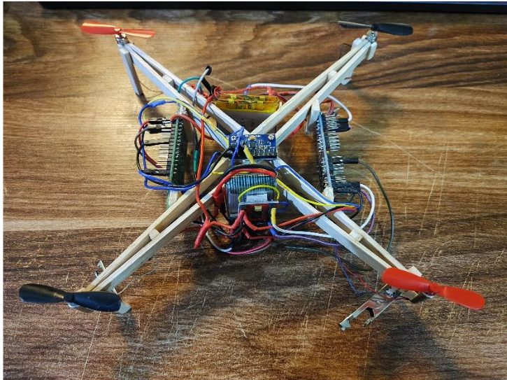
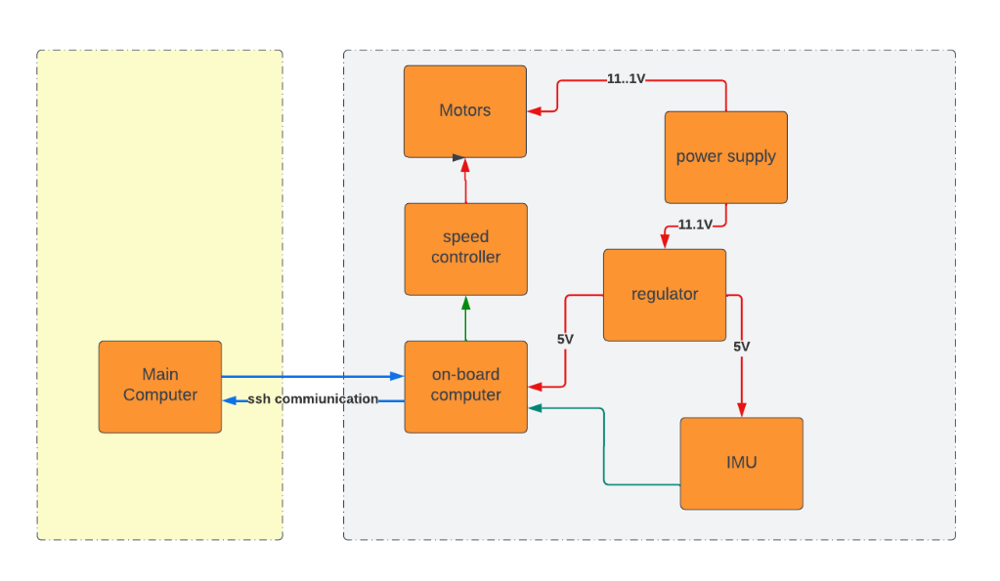
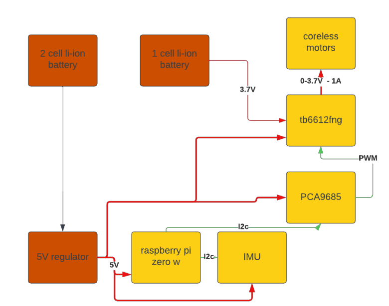
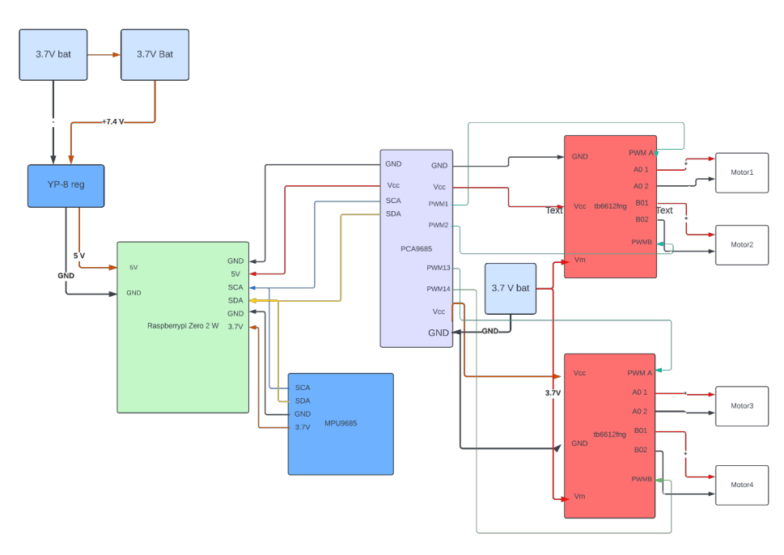
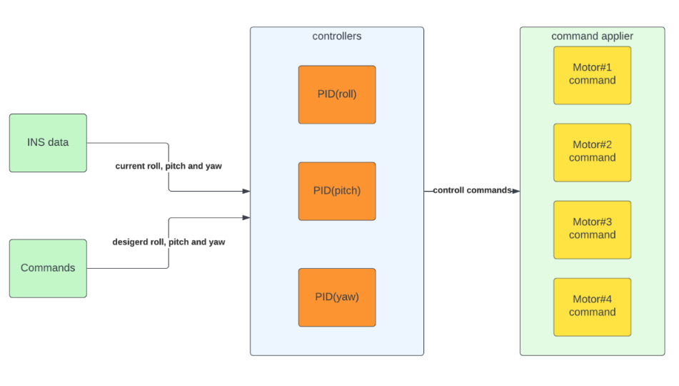
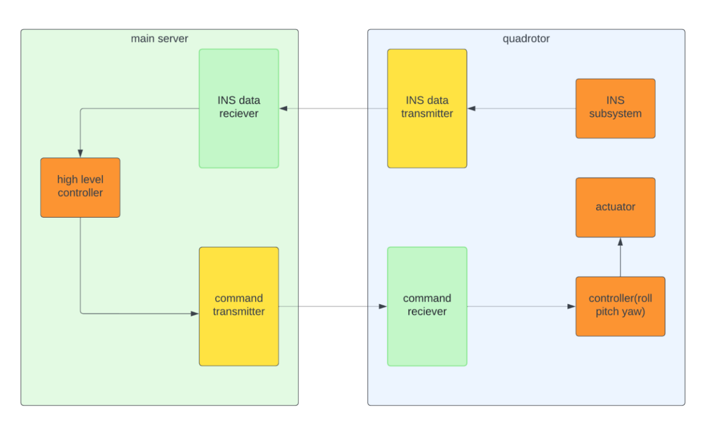
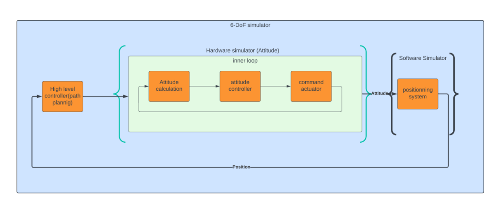

# HIL Quadrotor Simulator (6-DOF)

## 1. What is it?

This repository contains a **Hardware-in-the-Loop (HIL)** simulation platform for quadrotors.  
It connects a **real Raspberry Pi-powered quadrotor** to a **6-DOF software simulator** running on a PC.  
The system allows safe and low-cost development and testing of **autopilot algorithms**.

---

## 2. Why I Made This

Testing new autopilots directly on a flying quadrotor is **risky** and **expensive**.  
This project creates a middle ground: the real hardware responds to simulated commands while staying safe on the ground.  
By combining real sensors and actuators with a virtual flight model, developers can **test, train, and debug** autopilots before real flight.

---

## 3. How It Works

The system is made of **two parts**:

- A **real quadrotor** with a **Raspberry Pi Zero W2**, which runs a **PID controller** to stabilize itself based on incoming commands (roll, pitch, yaw).
- A **server (PC)** that:
  - Runs the **autopilot algorithm** and generates high-level commands (desired roll, pitch, yaw).
  - Sends these commands to the quadrotor over Wi-Fi.
  - Receives actual orientation data (from the Pi’s sensors).
  - Uses a 6-DOF dynamics model to simulate full motion.
  - Visualizes and plots the simulated and actual orientation for comparison and tuning.

The **autopilot software runs on the PC**, not on the Raspberry Pi. This makes it easier to develop and debug control logic.  
The Pi simply executes the incoming commands through its motor control loop and reports back sensor readings.

This setup allows **real-time interaction** between the simulated autopilot and physical sensors/actuators—combining safety with realism.

---

## 4. Hardware

The hardware includes:

- **Raspberry Pi Zero W2**
- **MPU9250**
- **PCA9685 as signal generator**
- **Coreless motors**
- **Battery & power module**
- **Fng6612b**

---

## 5. Software

### Onboard Raspberry Pi (Quadrotor):
- Written in Python
- Reads sensor data from IMU
- Runs **PID controllers** for roll, pitch, yaw
- Receives commands from the server
- Sends current orientation data back to the server

### On the Server (PC):
- Runs the **autopilot algorithm**
- Sends roll/pitch/yaw commands to the quadrotor
- Receives sensor feedback from the Pi
- Implements **6-DOF dynamics simulation**
- Plots response using **matplotlib**
- Enables PID tuning and autopilot evaluation

